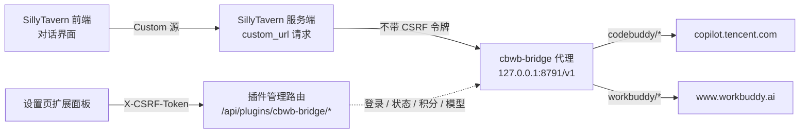

# SillyTavern × CodeBuddy / WorkBuddy Bridge

<p align="center">
  
  
  
  
  
</p>

<p align="center">
把 <b>腾讯 CodeBuddy（中国版）</b> 与 <b>WorkBuddy（国际版）</b> 的模型接进本地 SillyTavern，<br>
一次性接入、随时无损回滚，并可在面板里实时查看<b>剩余积分 / 用量</b>。
</p>

---

## 目录

- [这是什么](#这是什么)
- [特性](#特性)
- [工作原理](#工作原理)
- [环境要求](#环境要求)
- [安装](#安装)
- [使用](#使用)
- [配置项](#配置项)
- [常见问题 FAQ](#常见问题-faq)
- [排错](#排错)
- [上游协议实测结论](#上游协议实测结论)
- [项目结构](#项目结构)
- [开发与测试](#开发与测试)
- [安全说明](#安全说明)
- [English](#english)
- [License](#license)

---

## 这是什么

一个 **SillyTavern 服务器插件 + 前端扩展** 的组合，在 ST 进程内起一个 OpenAI 兼容代理，
把 ST 的请求转发给 CodeBuddy / WorkBuddy 的官方端点：

- **不需要第三方中转、不需要额外 API Key** —— 直接复用你自己的 CodeBuddy / WorkBuddy 账号额度（设备授权码登录）。
- **两条渠道共存** —— 用模型名前缀路由，在同一个 Custom 源里同时使用中国版与国际版模型。
- **可看用量** —— 面板实时显示两边的剩余积分、资源包明细、每日签到状态，方便控制消耗。
- **一键接入 / 一键回滚** —— 自动快照你原来的连接配置，随时原样还原。

> ⚠️ **非官方项目**。协议为逆向实测所得，与腾讯 / WorkBuddy 官方无关；上游一旦变更即可能失效。

---

## 特性

| 能力 | 说明 |
|---|---|
| 🔐 设备授权登录 | 复用 CodeBuddy / WorkBuddy 的官方登录流程，凭据加密落盘（`0600` 原子写），**到期前 1 小时自动静默续期** |
| 🔀 双渠道路由 | `codebuddy/<模型>` 与 `workbuddy/<模型>` 前缀路由，适配 ST 只有一个 Custom URL 槽位的限制 |
| 🧠 思考内容透传 | `reasoning_content` 原样流式回传，ST 的 Custom 分支直接可读，无需转换 |
| 💰 积分 / 用量面板 | 剩余额度、资源包明细（失效包单独列出不计入总额）、每日签到与一键领取 |
| 🔁 非流式兼容 | 上游只支持流式，代理自动把 SSE 聚合成完整 `chat.completion` 返回 |
| 🧩 WorkBuddy 首条 system 兜底 | 按产品能力自动补齐，避免 `code=11128` 被误报成「安全策略拦截」 |
| 👁 模型显隐 | 黑名单制，取消勾选即从 ST 模型下拉移除；新模型上线无需配置 |
| ↩️ 无损回滚 | 首次接入时快照原连接，随时「恢复原连接」 |
| 🧪 可自测 | 91 项独立冒烟测试，不依赖 ST 即可运行 |

---

## 工作原理



**为什么代理要单独监听一个端口，而不是挂在 `/api/plugins/*` 下？**

SillyTavern 的 CSRF 中间件在服务器插件挂载**之前**注册。浏览器调用的 UI 接口会带 `X-CSRF-Token` 所以能通过，
但 ST **服务端**去请求 `custom_url` 时不会带这个头 —— 因此对话代理必须是一个独立 HTTP 监听，天然绕开该中间件栈。

**两条渠道如何共存？** ST 的 Custom 源只有一个 `custom_url` 槽位，所以用**模型名前缀**做路由：

```
codebuddy/hy3            →  https://copilot.tencent.com     （腾讯 CodeBuddy）
workbuddy/gpt-5.6-sol    →  https://www.workbuddy.ai        （WorkBuddy 国际版）
hy3（无前缀）             →  走面板里设置的「默认渠道」
```

---

## 环境要求

| 项 | 要求 |
|---|---|
| SillyTavern | **≥ 1.12.0**（实测于 1.18.0） |
| Node.js | ≥ 18（SillyTavern 自带要求） |
| 网络 | 能直连 `copilot.tencent.com` / `www.workbuddy.ai` |
| 账号 | 至少一个 CodeBuddy 或 WorkBuddy 账号（登录需**真人**在浏览器完成） |
| 端口 | 本机 `8791` 空闲（被占用时会自动顺延并在面板显示实际端口） |

> 代理**只绑定 `127.0.0.1`**，并额外校验来源地址，不接受外部连接。

---

## 安装

### 第 0 步：获取代码

```bash
git clone https://github.com/kuroshio4396/SillyTavern-CodeBuddy-WorkBuddy-Bridge.git
cd SillyTavern-CodeBuddy-WorkBuddy-Bridge
```

不想用 git 的话，点本页右上角 **Code → Download ZIP** 再解压，效果一样。
下面所有命令都假定当前目录是**仓库根目录**。

---

要装的是**两个**部分，缺一不可：

| 部分 | 源目录 | 目标位置 |
|---|---|---|
| 服务器插件 | `server-plugin/` | `<SillyTavern>/plugins/cbwb-bridge/` |
| 前端扩展 | `ui-extension/` | `<SillyTavern>/public/scripts/extensions/third-party/cbwb-bridge/` |

> ⚠️ **不能只用 SillyTavern 的「从 URL 安装扩展」**——那只会装上前端部分，服务器插件（代理本体）仍需按下面步骤拷贝。

### 方式一：脚本安装（推荐）

```powershell
# Windows —— 在仓库根目录执行
.\scripts\install.ps1 -SillyTavernPath "D:\SillyTavern"
```

```bash
# macOS / Linux
./scripts/install.sh /path/to/SillyTavern
```

脚本会：备份 `config.yaml` → 打开 `enableServerPlugins` → 把两部分拷到正确位置 → 打印后续步骤。
加 `-DryRun`（bash 为 `--dry-run`）可只预览不落盘。

### 方式二：手动安装

**1) 拷贝两个目录**

```bash
# 把 server-plugin/ 的内容放到：
<SillyTavern>/plugins/cbwb-bridge/

# 把 ui-extension/ 的内容放到：
<SillyTavern>/public/scripts/extensions/third-party/cbwb-bridge/
```

**2) 打开服务器插件开关**

编辑 `<SillyTavern>/config.yaml`，找到并改为：

```yaml
enableServerPlugins: true
```

**3) 启动 SillyTavern**

```bash
# Windows
Start.bat
# macOS / Linux
./start.sh
```

启动日志里应出现这两行：

```
Initializing plugin from .../plugins/cbwb-bridge/index.js
[cbwb-bridge] OpenAI 兼容代理已监听 http://127.0.0.1:8791/v1
[cbwb-bridge] 插件已加载（v1.1.0）…
```

然后打开 `http://127.0.0.1:8000/`。

### 卸载

1. 先在面板点 **「恢复原连接」**；
2. 删除两个目录：
   ```bash
   rm -rf <SillyTavern>/plugins/cbwb-bridge
   rm -rf <SillyTavern>/public/scripts/extensions/third-party/cbwb-bridge
   rm -rf <SillyTavern>/data/cbwb-bridge        # 凭据与配置
   ```
3. 把 `config.yaml` 的 `enableServerPlugins` 改回 `false`，重启即可。

---

## 使用

### 1. 登录渠道

打开 ST 的 **扩展设置**，找到 **「CodeBuddy / WorkBuddy 桥接」** 折叠面板：

- 在 **CodeBuddy（腾讯）** 卡片点「登录」→ 浏览器弹出官方授权页 → 在页面上完成登录 → 面板会自动检测成功（最长等 5 分钟）。
- 想用国际版模型，同样在 **WorkBuddy（国际版）** 卡片点「登录」。
- 两个渠道可以同时登录，互不影响。

> 🔒 登录**必须真人操作**：这是设备授权码式的轮询登录（客户端不起回调服务器），无法脚本化，也不会经过本插件。

登录成功后卡片会显示账号、凭据到期时间、「静默续期已武装」。

### 2. 查看积分 / 用量

面板顶部的 **「积分 / 用量」** 卡片，两条渠道各一块：

- **大字数字**是该渠道当前可用的剩余额度；
- 下面一行说明有效资源包数量与上次更新时间；
- 展开 **「资源包明细」** 可看每个包的剩余 / 总量、有效期，已失效的包会**划掉并标注「已失效」**；
- 渠道卡里另有一行紧凑的「剩余积分」，不用展开就能看到。

几个口径说明：

- 余额取的是 **`CycleCapacityRemainPrecise`（本周期口径的精确值）**，与 IDE 里显示的一致；不是终身口径，也不是被截断的整数版。
- **已失效的资源包不计入总额**，单独统计为「另有 N 已失效」。
- 数字是**实时**的：你自己的 IDE 在跑，额度就会同步往下掉。
- 查不到时会明确说明原因（未登录 / 网络不通 / 凭据失效 / 响应格式异常），**不会显示成 0 积分**。

**CodeBuddy 另有「每日签到领积分」**（国际版没有这个活动）：签到区显示今日是否已签、连续天数、今日可领数额；
有可领额度时出现 **「领取每日积分」** 按钮。重复领取会被上游幂等拒绝，面板显示「今天已签到」而不是报错。

刷新节奏：打开面板拉一次，之后每 **3 分钟**自动刷新；点「刷新积分」或「刷新状态」立即强制刷新。

### 3. 接入 SillyTavern

在 **「接入 SillyTavern」** 卡片里：

1. 从「接入后使用的模型」下拉里选一个模型（例如 `codebuddy/hy3`）；
2. 点 **「接入本地桥接」**。

它会自动完成四步：记录原连接快照 → 把源切到 `Custom (OpenAI-compatible)` →
把 `custom_url` 写入 `http://127.0.0.1:8791/v1` → 触发一次 Connect 拉取模型列表。

### 4. 开始对话

回到对话界面正常发消息即可。正文与**思考内容**都会流式显示。

### 5. 模型显隐

面板底部「模型显隐」是**黑名单制**：默认全部显示，取消勾选即从 ST 模型下拉里移除。

### 6. 恢复原连接

点 **「恢复原连接」**，把源、`custom_url`、`custom_model` 原样还原成接入前的值。

- 快照**只在第一次接入时记录一次**，之后反复接入/恢复都用同一份，方便来回切。
- 面板上还有「重设快照为当前配置」，用于把快照改成你此刻的连接。

---

## 配置项

配置与凭据都存放在 `<SillyTavern>/data/cbwb-bridge/`：

| 文件 | 内容 |
|---|---|
| `config.json` | 桥接配置（默认渠道、代理端口、模型黑名单、快照） |
| `credentials.json` | 登录凭据（access / refresh token）—— **请勿外传**，已按 `0600` 权限原子写 |

常用的环境变量（一般不需要改）：

| 变量 | 默认 | 说明 |
|---|---|---|
| `CBWB_BRIDGE_PORT` | `8791` | 代理首选端口；被占用时自动顺延 |
| `CBWB_BRIDGE_DATA_DIR` | `<ST>/data/cbwb-bridge` | 数据目录（跑自测时会指向临时目录） |

`config.json` 主要字段：

```jsonc
{
  "defaultChannel": "codebuddy",   // 无前缀模型走哪条渠道
  "proxyPort": 8791,               // 首选端口；顺延后**不会**写回这里
  "useModelPrefix": true,          // 是否用渠道前缀暴露模型
  "hidden": [],                    // 隐藏的模型 id（黑名单）
  "creditsCacheTtlMs": 60000,      // 积分结果短缓存
  "snapshot": { }                  // 接入前的原连接快照
}
```

> **端口顺延不会污染配置**：若 8791 被占用，插件会顺延到 8792 并**只如实回报** `localBaseUrl`，
> 不把新端口写回 `proxyPort` —— 否则一次偶发冲突就会让配置永久偏移，而 ST 的 `custom_url` 还指着旧端口。

---

## 常见问题 FAQ

**Q：模型下拉是空的？**
先确认面板显示「本地代理 运行中」，然后点一次 ST 的 **Connect** 按钮，或面板上的「重拉模型目录」。

**Q：角色扮演被拒答 / 风格被改写？**
这是**上游限制**，不是实现问题。CodeBuddy / WorkBuddy 是编码向端点，对角色扮演类提示词会做审查或改写。

**Q：非流式请求（ST 的「静默提示词」「总结」、部分扩展）能用吗？**
能。上游**只接受流式**，所以代理对上游**永远发 `stream:true`**；客户端要非流式时，
代理把 SSE 分片聚合成一个完整的 `chat.completion` 再回传（正文 / 思考 / 工具调用分片都会正确归并）。

**Q：为什么 WorkBuddy 有时报「请求被安全策略拦截」？**
那多半是 `code=11128 first message is not system prompt` 被上游包装过的文案 —— **不是**真的内容审查。
WorkBuddy 国际版要求 `messages[0]` 必须是 `system` 角色；本插件会自动补一条空 system 兜底。详见下节。

**Q：积分显示「查询失败」怎么看原因？**

| 面板提示 | 含义 | 处理 |
|---|---|---|
| 未登录 —— 登录后即可看到剩余积分 | 该渠道没凭据 | 点登录 |
| 查询失败（网络不通） | 出不了网 / DNS 失败 | 检查代理与网络 |
| 查询失败（HTTP 4xx/5xx） | 多为 access_token 失效 | 点「手动续期」，不行就登出重登 |
| 查询失败（业务码 N） | 上游拒绝（如该账号未开通计费接口） | 记下业务码与消息 |
| 响应格式不符合预期 | 上游改了返回结构 | 需要更新 `lib/credits.js` 的解析 |

**Q：积分数值和我想的不一样？**
三个可能：① 只算「有效包」的本周期余额，失效包单列不计入；② 取的是 `Precise` 精确值（如 `247.87`）
而不是被截断的整数（`247`）；③ 你自己的 IDE 在跑，额度正在实时下降。都是预期行为。

**Q：为什么 WorkBuddy 没有签到区？**
签到活动只有中国版（CodeBuddy）有。但**积分余额查询两版都有**，国际版照样能看到剩余额度。

**Q：改端口后要做什么？**
面板没有改端口的入口（改了对 ST 的 `custom_url` 也要同步改，容易脱节）。如需换端口，
改 `data/cbwb-bridge/config.json` 的 `proxyPort` 后重启 ST，再点一次「接入本地桥接」。

---

## 排错

### 面板消息 → 含义

| 提示 | 原因 | 处理 |
|---|---|---|
| `渠道 CodeBuddy (腾讯) 尚未登录` | 还没登录，或凭据被清 | 在面板点登录 |
| `自动续期失败（refresh_token 已失效）` | refresh_token 过期 | 重新登录 |
| `上游限流，请稍后重试（额度重置时间：…）` | 命中 429 | 等重置时间，或换模型 |
| `额度不足或未开通` | 账号额度问题 | 检查账号状态 |
| `上游拒绝请求（HTTP 4xx code=…）` | 模型不可用或参数不合规 | 换模型；`11102` = 该模型后端未开放 |
| `code=11101 Non-stream chat…` | 上游只支持流式 | v1.1.0 已修；请确认版本 ≥ 1.1.0 |
| `code=11128 first message is not system prompt` | WorkBuddy 首条非 system | v1.1.0 已自动兜底；请确认版本 ≥ 1.1.0 |
| `code=11151 a message has empty content` | 历史里有空内容消息 | 清理该会话历史，或新建会话 |
| `上游首 token 超时` / `流式响应空闲超时` | 网关静默断流 | 重发；代理已主动断开，不会卡死 |
| `连接上游失败` | 网络问题 | 检查代理 / 网络 |

### 两个 ST 自身的行为（排错时会用到）

1. **ST 会把 401 改写成 400**（`src/util.js`，注释说明为避免重置 Basic auth），并把原始响应体原样交给客户端。
   所以桥接返回的 401 在流式请求里表现为 `400 + 原始 JSON` —— 这是预期行为。
2. **非流式请求**下 ST 只用 `statusText` 当错误消息，详细原因被丢弃；**流式请求**才完整透传。
   排错时优先看 ST 服务端控制台，那里会打印代理返回的原文。

更多内容见 [`docs/TROUBLESHOOTING.zh-CN.md`](docs/TROUBLESHOOTING.zh-CN.md)。

---

## 上游协议实测结论

这些都是**上游协议事实**，换模型 / 换账号 / 重登都不会消失；代理层已内建处理，但值得知道：

| 约束 | 触发条件 | 上游表现 | 本插件的处理 |
|---|---|---|---|
| **只支持流式** | 请求带 `stream:false` | `400 code=11101` | 对上游永远发 `stream:true`；客户端要非流式时聚合 SSE 回传 |
| **首条必须是 system**（仅 WorkBuddy 国际版） | `messages[0].role !== 'system'` | `400 code=11128`，且文案被包装成「请求被安全策略拦截」 | 按 `requiresLeadingSystemMessage` 能力位补一条空 system；CodeBuddy 不补 |
| **计费与对话的 `X-Product` 不同** | — | 计费接口用部署类型 `SaaS`，对话接口用产品名 `CodeBuddy`/`WorkBuddy` | 两处刻意不一致，代码里有注释 |
| **失效资源包会被一起返回** | — | 服务端把 `Status=3` / 已过期的包也算进列表 | 不计入总额，单独列为「已失效」 |
| **签到只在**中国版 | — | 国际版内核里没有签到字面量 | 国际版不显示签到区 |

两个实现要点（改动前请先读代码注释）：

- **SSE 聚合必须用 `StringDecoder` 增量解码**。直接对每个 TCP 分片 `toString('utf8')`，
  会在多字节汉字被切断时产出 `\uFFFD` 乱码。自测里有一项专门把 SSE 切成 **7 字节**小块来守这条。
- **`tool_calls` 要按 `index` 归并**，`function.name` / `arguments` 都会分片到达。

详见 [`docs/UPSTREAM-PROTOCOL.zh-CN.md`](docs/UPSTREAM-PROTOCOL.zh-CN.md)。

---

## 项目结构

```
.
├── server-plugin/                  # → <SillyTavern>/plugins/cbwb-bridge/
│   ├── index.js                    # 插件入口：起代理、注册管理路由、续期调度、退出清理
│   ├── package.json
│   ├── selftest.cjs                # 91 项独立冒烟测试（不依赖 ST）
│   └── lib/
│       ├── product.js              # 两条渠道的产品配置 + 协议常量 + UA 分档
│       ├── buddy.js                # JWT / 凭据 / 模型目录的纯解析逻辑
│       ├── oauth.js                # state→token→account→refresh 网络流程 + 续期调度器
│       ├── credentials.js          # 凭据落盘（0600，原子写）
│       ├── store.js                # 桥接配置落盘
│       ├── models.js               # 模型目录三层回退 + 模型 id 路由解析
│       ├── credits.js              # 积分 / 额度客户端（余额、签到状态与领取）
│       └── proxy.js                # OpenAI 兼容代理（SSE 透传 / 非流式聚合 / 首条 system 兜底）
├── ui-extension/                   # → <SillyTavern>/public/scripts/extensions/third-party/cbwb-bridge/
│   ├── manifest.json
│   ├── index.js                    # 面板逻辑
│   ├── settings.html               # 面板模板
│   └── style.css
├── scripts/
│   ├── install.ps1
│   └── install.sh
├── docs/
│   ├── TROUBLESHOOTING.zh-CN.md
│   └── UPSTREAM-PROTOCOL.zh-CN.md
├── CHANGELOG.md
├── SECURITY.md
└── LICENSE
```

---

## 开发与测试

插件自带 **91 项**独立冒烟测试，覆盖管理接口、代理端点、参数校验、配置读写、模型显隐、
登录通路、积分解析、积分接口、非流式聚合、首条 system 兜底，并会真实访问上游取 `state`。

```bash
cd server-plugin

# 方式 A：已装进 SillyTavern（会向上找到 ST 自带的 express）
node selftest.cjs

# 方式 B：独立运行
npm install --no-save express
node selftest.cjs
```

预期输出结尾：`===== 结果：91 通过 / 0 失败 =====`

> 自测会临时占用 `8791` / `8792` 做**端口顺延测试**，并断言偏移后的端口**不会**写回真实配置。
> 它使用隔离的临时数据目录，不会动你的 `credentials.json`。

---

## 安全说明

- 代理**只监听 `127.0.0.1`**，并校验来源地址；不对外开放。
- 凭据存放在 `<ST>/data/cbwb-bridge/credentials.json`（`0600` 原子写），
  **不写** ST 的 `secrets.json`（服务器插件拿不到用户上下文，强写会串号）。
- 对外视图（给 UI 用）**绝不返回** `refresh_token` 与完整 `access_token`，只回末尾 8 位用于辨认。
- 本仓库**不包含**任何账号凭据。提交前已扫描确认无 token / 密钥 / 个人路径。

详见 [`SECURITY.md`](SECURITY.md)。

---

## English

A **SillyTavern server plugin + UI extension** that bridges **Tencent CodeBuddy (China)** and
**WorkBuddy (International)** into SillyTavern through a local OpenAI-compatible proxy
(`127.0.0.1:8791/v1`).

- No third-party relay and no extra API key — it reuses your own CodeBuddy / WorkBuddy account
  quota via the official device-authorization login flow; tokens are stored locally and refreshed
  automatically one hour before expiry.
- Both providers coexist in a single Custom source, routed by model-name prefix
  (`codebuddy/<model>`, `workbuddy/<model>`).
- A settings panel shows live **remaining credits**, package breakdown, and the daily check-in.
- One-click attach with a snapshot of your previous connection, and one-click restore.

```
server-plugin/   →  <SillyTavern>/plugins/cbwb-bridge/
ui-extension/    →  <SillyTavern>/public/scripts/extensions/third-party/cbwb-bridge/
```

Then set `enableServerPlugins: true` in `config.yaml` and restart SillyTavern.

Requires SillyTavern ≥ 1.12.0 (tested on 1.18.0) and Node.js ≥ 18.

> ⚠️ **Unofficial project.** The upstream protocol was determined by empirical testing and is
> unrelated to Tencent / WorkBuddy. It may break if the upstream service changes.

---

## License

[MIT](LICENSE)
